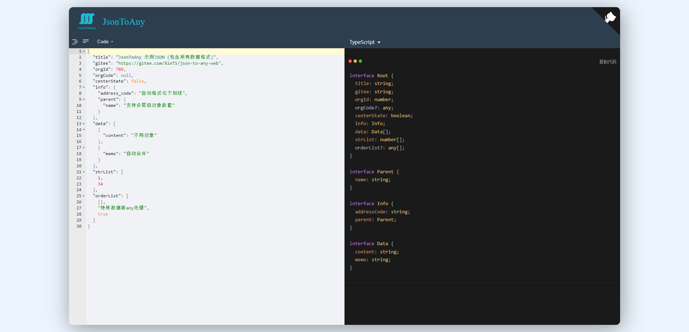
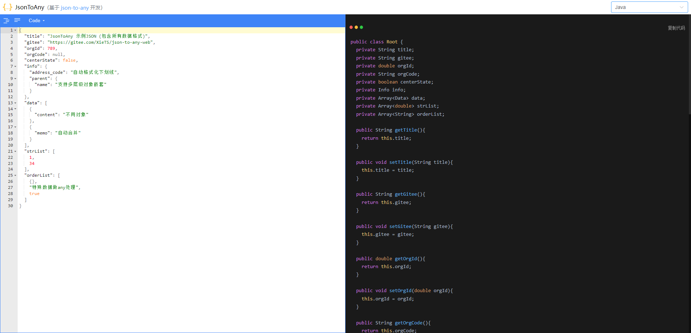
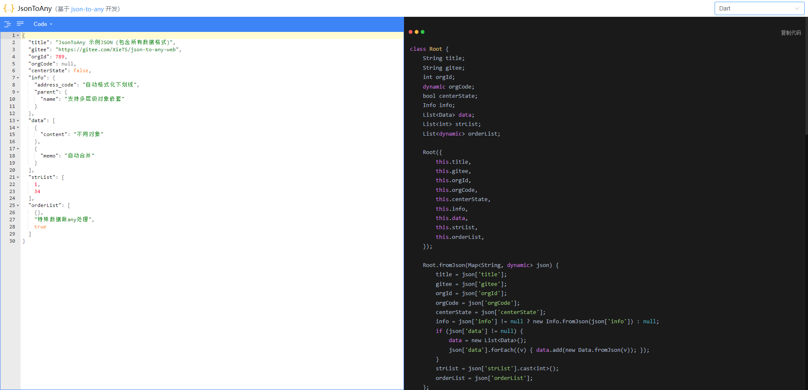

<p align="center" style="width: 300px">

</p>

<p align="center">


</p>


## 💡 背景

当公司项目拥抱 `TypeScript` 之后 ，前端接收到后端返回的接口数据，如果不进行ts类型声明，很容易导致整个项目沦为 `AnyScript`。

想要解决这一问题，需要我们开发人员手动处理好接口返回JSON数据，这对于开发效率无疑是灾难性的！

⚡️基于这一痛点，此项目诞生

⚡利用代码来取代这些繁琐的操作

## ✨ 功能

> 目前支持如下语言转换

* TypeScript（Web前端开发人员）
* Java（原生Android开发人员）
* Dart（Flutter开发人员）

## 🎉 效果

> JSON 转 TypeScript



> JSON 转 Java



> JSON 转 Dart



## 📝 使用

直接访问 [在线地址](http://xiets.gitee.io/json-to-any-web/)，开箱即用

当然，你完全可以对代码的生成结果进行定制化开发，加入一些公司项目中特定的语法

## 🔨 开发

```cmd
# gitee
git clone https://gitee.com/XieTS/json-to-any-web.git
# github
git clone https://github.com/xietiansheng/json-to-any-web.git

# 安装依赖（推荐pnpm）
npm install

# 启动服务
npm run dev
```

## 🔧 发布

```cmd
npm run build:prod
```

## 🔍️ 其他

```cmd
# 预览发布环境
npm run preview

# 代码格式检查
npm run lint

# 代码格式检查并自动修复
npm run lint -- --fix
```
